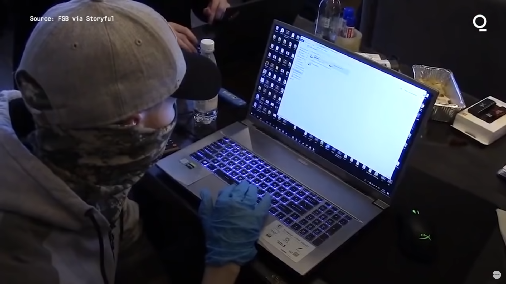

# Introduction

## Introduction to Digital Forensics

> Implementasi _computer science_ dan prosedur investigasi untuk kepentingan hukum, yang mencakup analisis _digital evidence_ setelah memperoleh otorisasi pencarian yang sah, pelaksanaan _chain of custody_, validasi menggunakan metode matematis, pemakaian alat yang sudah tervalidasi, penerapan prosedur yang dapat diulang, pembuatan laporan, dan kemungkinan presentasi oleh ahli.
>
> Ken Zatyko

Secara sederhana, _digital forensics_ adalah proses menggunakan teknologi untuk mengumpulkan bukti, menyelidikinya, dan mempresentasikan temuan tersebut dalam sebuah kasus hukum. Proses ini dapat mencakup pemeriksaan aktivitas jaringan, _access logs_, riwayat pencarian, dan media penyimpanan digital seperti _hard disks_ dan perangkat seluler, serta analisis data tersebut untuk mengidentifikasi bukti aktivitas kriminal atau pelanggaran lainnya.

## **Beberapa kasus penggunaan:**

* **Investigasi serangan siber** — Dalam kasus pelanggaran keamanan atau serangan siber, _digital forensics_ dapat digunakan untuk menentukan ruang lingkup serta sumber serangan. Informasi ini kemudian dapat digunakan untuk memperkuat pertahanan organisasi terhadap serangan di masa depan.
* **Deteksi dan respons ancaman** — Sangat berguna untuk secara proaktif mengidentifikasi dan mengurangi ancaman keamanan.
* **Pemulihan data** — _Digital forensics_ juga dapat digunakan untuk memulihkan data yang mungkin telah dicuri atau dihapus selama serangan.
* **Investigasi kriminal** — Bukti yang dikumpulkan dapat digunakan untuk mengidentifikasi tersangka, menetapkan motif, dan menghubungkan tersangka dengan kejahatan tertentu.

Tujuan utamanya adalah mengumpulkan bukti yang dapat digunakan untuk menuntut tersangka di pengadilan.

## Motivation

> You are leaving a trail, albeit a digital one; it's a trail nonetheless.
>
> John Sammons

*   **REvil Ransomware Group gets arrested in Russia**

    

    [Link to video](https://www.youtube.com/watch?v=OqEWuFmzhzs)
*   **Author of Raccoon Stealer gets arrested in Netherlands**

    

    [Link to tweet](https://twitter.com/vxunderground/status/1587304651426332673)
*   **Bagaimana Sebuah Floppy Disk Menjatuhkan BTK Killer**

    [Link to article](https://www.refinery29.com/en-us/2019/08/240899/btk-killer-caught-when-how-floppy-disk-dennis-rader)

## **Dasar-Dasar Command Line Linux**

Bagian ini berfungsi sebagai pengantar ke alat _command line_ Linux yang penting dalam forensik digital. Ada banyak perintah Linux yang berguna dalam forensik, namun beberapa yang paling mendasar meliputi:

### **ls** — Digunakan untuk menampilkan daftar file dan direktori dalam sebuah direktori.

* Perintah `ls` memungkinkan Anda melihat daftar semua file dan folder di dalam folder tertentu.

```
$ ls
Desktop  Documents  Downloads  Music  Pictures  Public  Videos
```

### **cd** — digunakan untuk mengganti direktori kerja saat ini.

Perintah `cd` memungkinkan Anda berpindah ke folder tertentu.

```
$ cd Desktop/
```

### **cat** — digunakan untuk menampilkan isi dari sebuah file.

Perintah ini (singkatan dari "concatenate") menampilkan isi file secara langsung di terminal.

```
$ cat file.txt 
Hello World!
```

### **strings** — digunakan untuk menampilkan string yang dapat dibaca di dalam file.

Perintah ini sangat membantu dalam mengidentifikasi karakter yang dapat dibaca manusia, khususnya dalam file biner.

```
$ strings file.txt 
Hello World!
```

```
$ strings /bin/bash
/lib64/ld-linux-x86-64.so.2
 $DJ
CDDB
E`% 
`0 	
"BB1
B8: 
0D@kB
) 9E4
NR l
 "?$aD
!A8H
h% H0A
Hap5
($B 
d> 7
<SNIP>
```

### **grep** — digunakan untuk mencari string atau pola tertentu dalam satu atau beberapa file.

Perintah `grep` sangat berguna untuk mencari string di dalam file berukuran besar, seperti file log. `grep` dapat mempercepat proses investigasi secara signifikan dengan memungkinkan Anda mencari pola seperti URL, alamat email, hash MD5, dan lain-lain.

```
$ grep "Hello" file.txt 
Hello World!
```

### **find** — digunakan untuk mencari file dan direktori.

Dengan `find`, Anda dapat menemukan berbagai jenis file berdasarkan jenis, izin, atau waktu modifikasi.

```
$ find . -type d
.
./Music
./Public
./Downloads
./Desktop
./.config
./.config/autostart
./.config/xfce4
./.config/xfce4/panel
./.config/cherrytree
./.config/powershell
./Pictures
./Documents
./.java
./.java/.userPrefs
./.java/.userPrefs/burp
./Videos
```

Perhatikan bagaimana output di atas menampilkan beberapa direktori lebih banyak dibandingkan perintah `ls`.

### **md5sum, sha1sum** — digunakan untuk menghitung hash MD5 dan SHA1 dari sebuah file.

Kedua perintah ini menerima input dan menghasilkan string dengan panjang tetap, yang juga dikenal sebagai _hash_ atau _checksum_. Jika isi file berubah, bahkan sedikit saja, _hash_ yang dihasilkan akan berbeda. Hal ini berguna untuk mendeteksi apakah file telah diubah atau dirusak.

```
$ md5sum file.txt 
8ddd8be4b179a529afa5f2ffae4b9858  file.txt
```

```
$ sha1sum file.txt 
a0b65939670bc2c010f4d5d6a0b3e4e4590fb92b  file.txt
```

### **netstat** — digunakan untuk menampilkan informasi tentang koneksi jaringan pada sistem.

Tools ini memberikan informasi yang berguna tentang koneksi aktif pada sistem. Informasi yang ditampilkan mencakup alamat dan port lokal serta jarak jauh dari koneksi yang sedang aktif.

```
$ netstat
Active Internet connections (w/o servers)
Proto Recv-Q Send-Q Local Address           Foreign Address         State      
tcp        0      0 192.168.0.106:44300     239.237.117.34.bc:https ESTABLISHED
tcp        0      0 192.168.0.106:39884     93.184.220.29:http      ESTABLISHED
tcp        0      0 192.168.0.106:58308     ec2-52-39-122-167:https ESTABLISHED
tcp        0      0 192.168.0.106:56910     static-48-7-129-15:http ESTABLISHED
udp        0      0 192.168.0.106:bootpc    192.168.0.1:bootps      ESTABLISHED
```

### **file** — digunakan untuk menentukan jenis file berdasarkan isinya

Perintah `file` dapat digunakan untuk mengidentifikasi jenis file seperti teks, gambar, audio, video, dan file eksekusi. Perintah ini juga dapat digunakan untuk mengidentifikasi file yang tidak dikenal yang mungkin berpotensi berbahaya.

```
$ file /etc/passwd
/etc/passwd: ASCII text
```

```
$ file image.png 
image.png: PNG image data, 562 x 424, 8-bit/color RGB, non-interlaced
```

### **xxd** — digunakan untuk mencetak _hex dump_ dari sebuah file tertentu

Perintah `xxd` berguna untuk menampilkan _hex dump_ dari sebuah file atau input standar. Perintah ini juga dapat mengonversi _hex dump_ kembali ke bentuk biner aslinya.

```
$ xxd image.jpg 
00000000: ffd8 ffe0 0010 4a46 4946 0001 0101 0048  ......JFIF.....H
00000010: 0048 0000 ffdb 0043 0005 0304 0404 0305  .H.....C........
00000020: 0404 0405 0505 0607 0c08 0707 0707 0f0b  ................
00000030: 0b09 0c11 0f12 1211 0f11 1113 161c 1713  ................
00000040: 141a 1511 1118 2118 1a1d 1d1f 1f1f 1317  ......!.........
00000050: 2224 221e 241c 1e1f 1eff db00 4301 0505  "$".$.......C...
```

### **hexedit** — digunakan untuk mengedit file dalam format heksadesimal

Alat `hexedit` memungkinkan Anda untuk mengedit byte mentah dari sebuah file secara interaktif. Alat ini sering digunakan untuk memperbaiki file yang rusak.

```
$ hexedit image.jpg
```


### **ps** — digunakan untuk menampilkan daftar proses yang berjalan di sistem

Perintah `ps` memungkinkan Anda melihat daftar semua proses yang sedang berjalan di komputer Anda. Informasi yang ditampilkan mencakup ID proses, pengguna, status, dan perintah yang memulai proses tersebut.

```
$ ps                    
    PID TTY          TIME CMD
   1824 pts/0    00:00:09 zsh
   2879 pts/0    00:00:05 sublime_text
   2924 pts/0    00:00:00 plugin_host-3.3
   2927 pts/0    00:00:00 plugin_host-3.8
  22666 pts/0    00:00:00 ps
```

## **Latihan**

Untuk bagian ini, berikan perintah lengkap untuk setiap latihan yang meminta perintah, dan berikan jawaban deskriptif untuk bagian yang meminta penjelasan. Mungkin ada beberapa jawaban atau perintah untuk latihan-latihan ini, jadi silakan berikan jawaban yang paling nyaman bagi Anda.

### Pertanyaan

1. Jika kita ingin menampilkan semua file .txt di direktori saat ini, perintah apa yang akan kita gunakan?
2. Perintah apa yang dapat kita gunakan untuk membaca isi file `/etc/passwd`?
3. Jika kita ingin mencari string "Error" di semua file dalam direktori `/var/log` directory, what would our command be?
4. Apa perintah yang digunakan untuk menghitung hash MD5 dan SHA1 dari file `/etc/passwd`?
5. Gunakan perintah `file` untuk menentukan jenis file dari `/usr/bin/cat` dan jelaskan outputnya dalam 2-3 kalimat.
6. Perintah apa yang dapat kita gunakan untuk menampilkan semua string yang dapat dicetak dengan panjang `/bin/bash`?
7.  Diberikan output perintah `file` berikut, dapatkah Anda menentukan apa yang salah dengan file ini?

    ```
    $ file image.jpg
    image.jpg: ELF 64-bit LSB pie executable, x86-64, version 1 (SYSV), dynamically linked, interpreter /lib64/ld-linux-x86-64.so.2, BuildID[sha1]=3ab23bf566f9a955769e5096dd98093eca750431, for GNU/Linux 3.2.0, not stripped
    ```
8. Jika kita ingin mencari file yang dimodifikasi dalam 30 menit terakhir di direktori `/home` perintah apa yang akan kita gunakan?_`Petunjuk:`_` ``Jelajahi cara menggunakan perintah find untuk mencapai tujuan ini`
9. Perintah apa yang dapat kita gunakan untuk menampilkan informasi tentang semua koneksi TCP aktif di sistem?
10. Diberikan [file gambar yang rusak](files/challenge.png), dapatkah Anda menemukan cara untuk memulihkan dan melihat isinya?\
    _`Petunjuk 1:`_` ``Pencarian cepat di Google untuk "magic bytes" mungkin membantu.`\
    _`Petunjuk 2:`_` ``Jelajahi cara menggunakan hexedit untuk membantu Anda di sini.`

    Anda dapat mengunduh gambar menggunakan perintah berikut:

    ```
    curl https://raw.githubusercontent.com/vipkas/Digital-Forensics/main/00/files/challenge.png -o challenge.png
    ```
