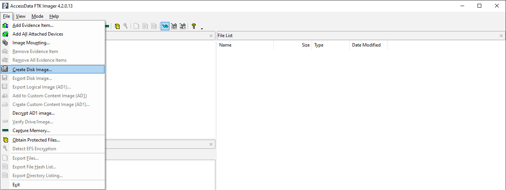
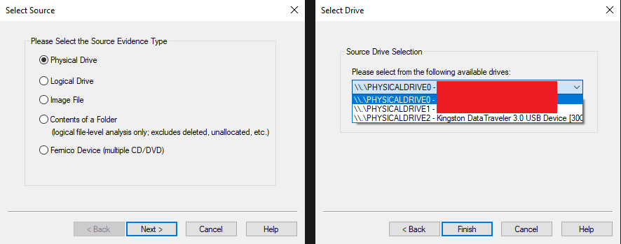
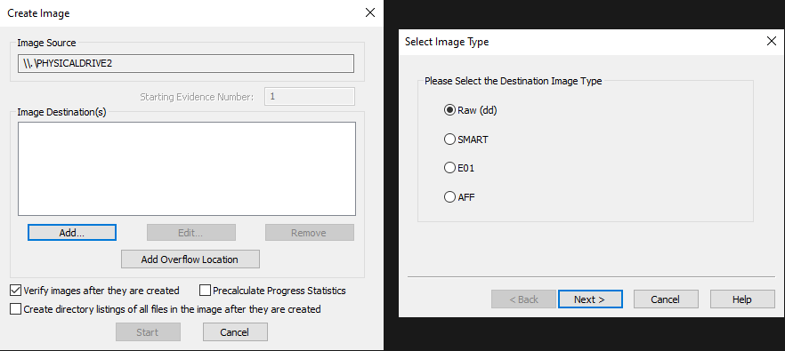
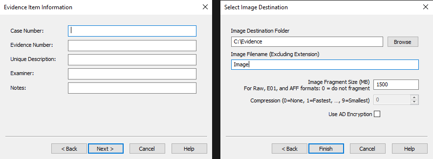
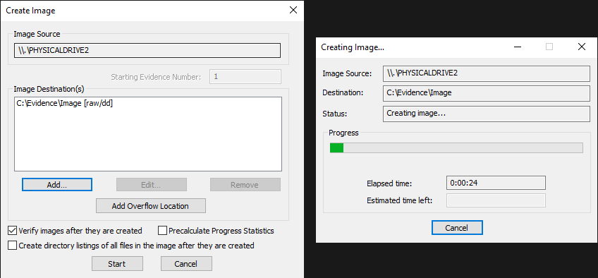
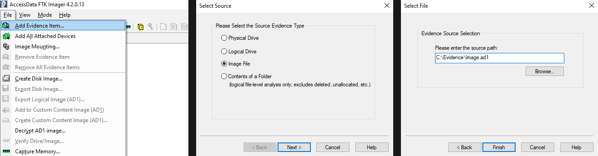
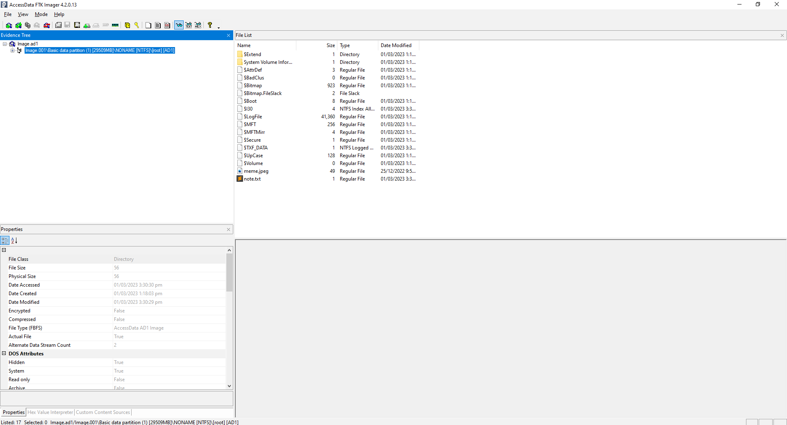
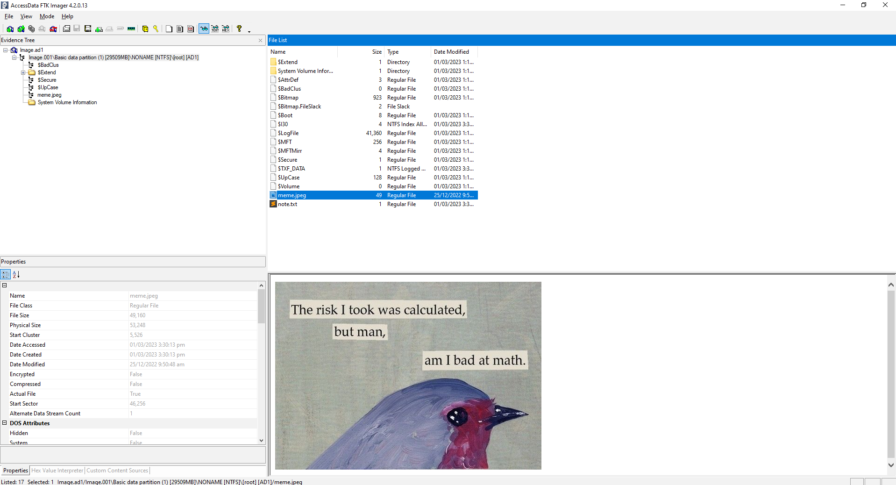

# Lab 2 — Disk Image Forensics

## Disk Image Forensics

Perangkat penyimpanan digital, seperti hard drive, solid-state drive, dan USB drive, menyimpan data dalam jumlah besar yang dapat sangat penting dalam investigasi forensik digital. Forensik disk image adalah proses menganalisis perangkat ini beserta isinya untuk mencari informasi yang berguna selama investigasi.

Dalam lab ini, kita akan mempelajari dasar-dasar forensik disk image, termasuk terminologi dasar serta langkah-langkah yang diperlukan dalam mengakuisisi dan menganalisis disk image.

**Terminologi Dasar**

* **Disk Image**\
  Disk image adalah salinan bit demi bit dari seluruh disk (seperti hard drive, USB, dll.) atau partisi yang mempertahankan konten dan struktur asli data tersebut. Disk image mencakup tidak hanya file dan folder, tetapi juga ruang kosong, metadata, dan data tersembunyi lainnya yang biasanya tidak terlihat.
* **Disk Imaging**\
  Disk imaging adalah proses membuat salinan forensik dari perangkat penyimpanan, seperti hard drive atau USB drive. Ini adalah langkah penting dalam forensik digital karena memastikan data asli tetap utuh dan tidak dimodifikasi. Hash kriptografi digunakan untuk memverifikasi bahwa salinan ini sama persis dengan aslinya, memastikan bahwa tidak ada perubahan yang dilakukan pada data asli. Dengan pendekatan ini, penyidik forensik dapat bekerja dengan salinan tanpa khawatir secara tidak sengaja mengubah data asli.
* **Forensik Disk Image**\
  Forensik disk image adalah proses menganalisis disk image untuk mencari bukti yang relevan. Ini mencakup penggunaan alat seperti _Autopsy_ dan _FTK Imager_ untuk menemukan informasi yang berguna dan menganalisis artefak sistem seperti _Windows registry_, _web browser_, _LNK Files_, _event logs_, riwayat _command prompt_, dan lainnya. Meskipun _Autopsy_ menawarkan lebih banyak fitur selama analisis, kita akan menggunakan _FTK Imager_ karena sifatnya yang ringan.

Tools ini dapat diunduh dari [https://www.exterro.com/ftk-imager](https://www.exterro.com/ftk-imager), jadi pastikan Anda telah menginstal FTK Imager di komputer sebelum melanjutkan lab.

## **Akuisisi Disk Image**

Berikut adalah panduan langkah demi langkah untuk membuat disk image menggunakan FTK Imager:

1.  Buka FTK Imager, lalu buka **File → Create Disk Image**.

    
2.  Pilih **Physical Drive**, kemudian klik _Next_ dan pilih drive yang akan di-_image_. Untuk contoh ini, saya akan memilih USB drive

    
3.  Klik tombol **Add** di bawah **Image Destination(s)**, lalu pilih jenis image sebagai _Raw (dd)_.

    
4.  Masukkan detail yang relevan tentang bukti, lalu pilih folder dan nama untuk menyimpan disk image.

    
5.  Klik **Start** untuk memulai proses pembuatan. Proses ini mungkin memerlukan waktu tergantung pada ukuran drive.

    

## Menganalisis Disk Image

Setelah disk image diakuisisi, langkah selanjutnya adalah menganalisisnya untuk mencari bukti yang terkait dengan investigasi.

> 💡 Meskipun FTK Imager ringan, penggunaannya membutuhkan pengetahuan awal tentang file yang ada di dalam disk image serta lokasinya. Di sisi lain, _Autopsy_ secara otomatis mem-parsing informasi berguna seperti gambar, riwayat internet, geolokasi, _timeline_, dll. _Autopsy_ juga dapat memulihkan file yang dihapus, mencari pola dalam disk image, dan menghasilkan laporan rinci. Jadi saya menyarankan Anda untuk menjelajahinya juga.

Untuk mengunduh disk image, gunakan tautan berikut.

[https://github.com/vipkas/Digital-Forensics/blob/main/02/files/Image.ad1](02/files/Image.ad1)

Untuk membuka disk image di FTK Imager:

1. Klik **File** dan pilih **Add Evidence Item**.
2. Pilih **Image File** dan pilih disk image yang ingin Anda analisis.

Setelah membuka disk image di FTK Imager, Anda akan melihat empat bagian di jendela:

* **Evidence Tree** di kiri atas, yang menampilkan tata letak disk image secara hierarkis.
* **Properties** di kiri bawah, yang menampilkan metadata file yang dipilih, seperti nama, tanggal modifikasi terakhir, hash MD5 dan SHA1, dll.
* **File List** di bagian tengah atas, yang menampilkan daftar file dan direktori dalam partisi atau image yang dipilih.
* **Preview** di bagian bawah, yang menampilkan pratinjau atau isi heksadesimal file yang dipilih.

Untuk menelusuri sistem file di dalam disk image, kita perlu memperluas _evidence tree_ yang terletak di area kiri atas.

Direktori root dari USB Drive yang di-image akan ditampilkan, memungkinkan kita untuk memilih dan melihat isi file apa pun. Sebagai contoh, kita dapat mengakses dan melihat file `note.txt` dan `meme.jpeg` yang awalnya disimpan di USB drive.

Kita juga dapat mengekstrak file yang mungkin menarik dengan cara mengklik kanan pada file tersebut dan memilih **Export Files**.

**Beberapa File Penting dalam Disk Image**

* **$MFT** — _Master File Table_ adalah file penting di sistem file NTFS yang menyimpan informasi tentang semua file dan direktori pada volume, termasuk nama, izin, dan atribut. File ini juga berisi informasi tentang lokasi setiap file di disk.
* **$MFTMirr** — File ini adalah cadangan dari $MFT dan penting jika $MFT asli rusak.
* **$LogFile** — File ini merekam informasi jurnal transaksi metadata (area MFT) dan dapat digunakan untuk memulihkan dari crash sistem.

Untuk menganalisis file-file ini, tersedia beberapa alat seperti [analyzeMFT](https://github.com/dkovar/analyzeMFT) atau [MFTECmd](https://github.com/EricZimmerman/MFTECmd) yang dapat diunduh dari[https://ericzimmerman.github.io/#!index.md](https://ericzimmerman.github.io/#!index.md).

> 💡 Ada banyak file lain yang mungkin ada dalam disk image seperti $Boot, $Secure, $Volume, dll. Silahkan Anda untuk mengeksplorasi file-file ini secara mandiri sebagai bagian dari proses pembelajaran Anda.

## **Kesimpulan**

Dalam lab ini, kita telah mempelajari beberapa terminologi dasar, kemudian mempelajari cara mengakuisisi disk image. Setelah itu, kita menjelajahi beberapa file yang umum ditemukan dalam disk image dan bahkan melakukan analisis dasar menggunakan FTK Imager. Namun, penting untuk diingat bahwa disk image yang kita analisis adalah USB drive kecil, dan ada lebih banyak hal untuk dianalisis dalam disk image hard drive yang lebih besar. Ini mungkin memerlukan pencarian artefak umum, seperti _Windows Registry_, riwayat peramban, _Event Logs_, riwayat konsol, dan apa pun yang dapat memberikan wawasan berharga untuk investigasi.

## **Latihan**

Gunakan disk image dari bagian _Analyzing a Disk Image_ untuk menjawab pertanyaan berikut:

1. Apa hash MD5 dan SHA1 dari file `note.txt`?
2. Berapa nomor rekaman MFT dari file `note.txt`? Jawaban mungkin berbeda tergantung metode yang digunakan.
3. Dapatkah Anda menentukan direktori induk dari file bernama $Txf? Anda dapat menggunakan _analyzeMFT_ atau _MFTECmd_ untuk memeriksa isi file $MFT dan menjawab pertanyaan ini.
4. Gambar `meme.jpeg` awalnya diunduh dari URL twitter. Dapatkah Anda menggunakan _MFTECmd_ untuk menentukan URL asli?
5. Dapatkah Anda menganalisis file $Boot dan menemukan nomor seri volume dalam format heksadesimal?
